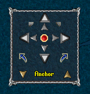

# BoatControl Command

This is a plug&play command that shows a gump used to control a boat. The gump will only be opened if if player is on a boat. The gump was created by [Haazen](http://www.runuo.com/community/members/haazen.35884/) as part of his [Tiller Bell](http://www.runuo.com/community/threads/tiller-bell.53652/) script released on RunUO Forums in 2005.

To install, just drop this script in your Scripts folder.

To use, players just need to type the command: **[BoatControl**
