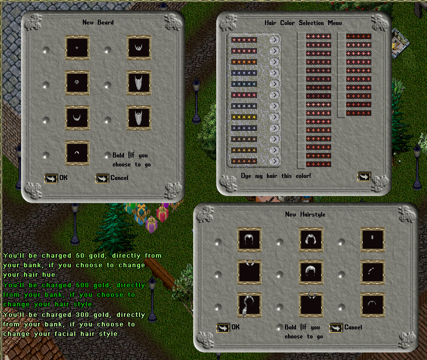

# ChangeHairStyle Command

This is a plug&play command for players to change their hair style and hue.

## Some notes

It's based on RunUO's ChangeHairstyleGump and ChangeHairstyleGump from the CustomHairstylist vendor, and it has only been implemented for human hairstyles.

So, with this command, the Hairstyle and Beardstyle gumps will only be displayed for Humans. And the Beardstyle gump will only be displayed for males.

The only gump that will always be displayed, regardless the player race/gender, is the Hair Hue Gump.

Prices you set to 0, on the script Config, won't send messages those green messages you see on the screenshot and players won't be charged.

## Usage

To use it, players just need to type in-game: **[ChangeHairStyle**

## Install

Just drop this script anywhere inside your Scripts folder.

## Configuration

On the Config class of this script you can easily customize it.

    bool Enabled = true;                  // Is this command enabled?
    int PriceForHairHue = 50;             // What's the price for changing hair hue?
    int PriceForHairStyle = 500;          // What's the price for changing hair style?
    int PriceForFacialHairStyle = 300;    // What's the price for changing facial hair style?
    bool DisplayRegularHues = true;       // Should we display regular hues (true) or bright hues (folse) on the hair hue gump?
