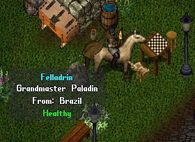
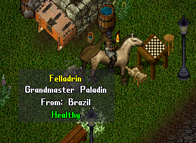

# Clone Character On Logout

This is something I always wanted to do. Took me all day long to get it working properly, but finally it's here.

It's a plug&play script that creates a clone of your players characters when they logout. And it's deleted as soon as they reconnect.

The clone is invulnerable, so players won't be able to kill them to get their items.

If player is mounted when logging out, the clone will be mounted in a copy of their mount.

The clone displays the property list of the original mobile, so moving the mouse over the clone will display the same as hovering the original mobile, except the name color, that will be yellow.

Other players can train skills with the clone, all skills that the original player has above 60 will be available to be trained.

Staff members characters won't be cloned.

## Original vs Clone:

 

## Install

Just drop this script anywhere inside your Scripts folder.

## Configuration

You can change configs on the script to suit to your needs:

    bool Enabled = true;      // Is this system enabled?
    bool CanWander = true;    // Can the clones wander freely around the world or should they be frozen?
    bool CanTeach = true;     // Can other player train skills with this clone?

## Wiping Clones

Clones are deleted automatically when original players login, but if for some reason you need to wipe all the clones from the server, use the staff command:

> [global remove where characterclone
