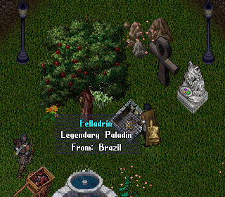

## Display country under character's name

This script displays the player country based on their client's language code.

### Install

Download `Country.cs` and drop it anywhere inside your scripts folder.

Then open `PlayerMobile.cs` and find the *Target Block*:

    public override void GetProperties(ObjectPropertyList list)
    {
        base.GetProperties(list);

**Above** the *Target Block* (Outside the GetProperties method), add:

    #region Display country under character name
    [CommandProperty(AccessLevel.GameMaster)]
    public string Country
    {
        get
        {
            if (m_Country == null && Language != null)
                m_Country = Felladrin.Utilities.Country.GetNameFromCode(Language);

            return m_Country;
        }
    }
    string m_Country;
    #endregion

**Below** the *Target Block* (Inside the GetProperties method), add:

    #region Display country under character's name
    if (Country != null)
    {
        list.Add(1060658, "{0}\t{1}", "From", Country);
    }
    #endregion

### Uninstall

Just remove the two blocks of code you've added, and delete `Country.cs`.
