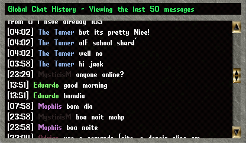

# Global Chat

A simple global chat system with a history gump and auto-colored names.

The History gump display messages from the newest (top) to the oldest (bottom).

## Commands

> **[C (message)**  
> Broadcasts a message to all players online. If no message is provided, it opens the Chat History.
>
> **[ChatHistory**  
> Opens the Chat History.
>
> **[ChatToggle**  
> Enables or Disables the Chat for your account.

## Install

Just drop this script anywhere inside your Scripts folder.

## Configuration

You can change some configs on the top of the file.

    bool Enabled = true;               // Is this system enabled?
    bool OpenHistoryOnLogin = true;    // Should we display the history when player logs in?
    bool AutoColoredNames = true;      // Should we auto color the players names?
    int HistorySize = 50;              // How many messages should we keep in the history?
    int MessageHue = 1154;             // What is the hue of the chat messages?
