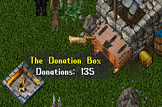

## Global Donation Box

This is a singleton Donation Box that should be placed on the hot point of your shard.

Players can donate items from anywhere by using a command that send the items directly to the box.

As soon as an item is added to the box, it gets categorized according to its type, then stored in its respective category-bag.

The category-bags can't be taken from the box. The script calculates their position trying leave a little margin among them, to avoid placing a bag over another, but if there are too many bags, it wouldn't be possible to leave a margin for all, so it only tries repositioning them a few times. Players can then move those bags which are over others.

If a container is donated, all items inside the container will be categorized and split through the category-bags. Even a chain of containers inside containers will be, in the end, empty and their items properly separated into category-bags. So if you want to mass-donate items after a raid, it's a good idea to put all them in a backpack, for example, and donate the backpack.

To pick up items from the box is normal: come close the box, open it, look for something interesting inside the category-bags and take whatever you want.

## Screenshot

## Installation

Just drop this script anywhere inside your Scripts folder.

## Commands

> **[Donate**  
Player Command - Used to donate items from your backpack.

> **[DonationBox**  
Administrator Command - Places the Donation Box at your current location.
