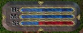

# Running Fatigue

With this script, characters get tired regardless of their level when they run by foot.

As it can unbalance UO combat, it's recommended only for RP shards.

Staff members are not affected.

## Install

Open `Scripts/Misc/WeightOverloading.cs` and, inside *EventSink_Movement* method, find:

	if (((from.Stam * 100) / Math.Max(from.StamMax, 1)) < 10)
			--from.Stam;

	if (from.Stam == 0)
	{
			from.SendLocalizedMessage(500110); // You are too fatigued to move.
			e.Blocked = true;
			return;
	}

	if (from is PlayerMobile)
	{
			int amt = (from.Mounted ? 48 : 16);
			PlayerMobile pm = (PlayerMobile)from;

			if ((++pm.StepsTaken % amt) == 0)
					--from.Stam;
	}

Replace this block with the following:

	Felladrin.Automations.RunningFatigue.Apply(from);
