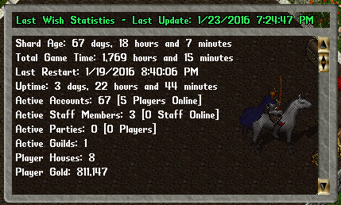

# Statistics

This is an automated script that collects and displays shards statistics in-game and on console.

In-game command: **[Statistics**

All those statistics are publicly accessible, so you can integrated with other scripts, like displaying the statistics on web status page.

## Install

Just drop this script anywhere inside your Scripts folder.

## Configuration

You can change Configs on the of the script:

    bool Enabled = true;                            // Is this system enabled?
    bool ConsoleReport = true;                      // Should we report statistics on console?
    TimeSpan Interval = TimeSpan.FromMinutes(1);    // How often should we update statistics?
    AccessLevel CanSeeStats = AccessLevel.Player;   // What's the level required to see statistics in-game?
    AccessLevel CanUpdateStats = AccessLevel.Seer;  // What's the level required to update statistics in-game?
