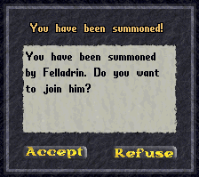

## Summon Command

This is a plug&play command to let players summon other players, to bring them to their position, saving the time they would spend traveling. The command has a cooldown, so players need to wait some time before using it again.

### Install

Just drop this script anywhere in your Scripts folder.

### Configuration

You can configure it on the top of the script:

    bool Enabled = true;                                    // Is this command enabled?
    bool CanBeUsedInCombat = false;                         // Can they use this command while in combat?
    bool CanBeUsedWhileDead = false;                        // Can they use this command while they are dead?
    TimeSpan Cooldown = TimeSpan.FromMinutes(1);            // How long players need to wait before using the command again?
    TimeSpan AutoRefuseDelay = TimeSpan.FromSeconds(30);    // How long should the gump be displayed for the summoned?

### Usage

In-game, just type `[Summon` to see a list of players available to summon.  
You can also use `[Summon <name>` to filter the list or directly summon a specific player.

### Screenshot

  
*Gump seen by the summoned.*
