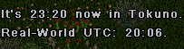

# Time Command

This is a recplacement for the default [Time command. It informs the in-game time of your current region besides the the real-world time (UTC).

## Installation

1. Drop this script anywhere inside your Scripts folder.
2. Delete the default Time Command file: `Scripts/Commands/ShardTime.cs`
