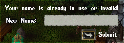

# Unique Character Names

This is a plug&play script that grants every player character have a unique name. The verification is made on character login, and if the name is already in use, the character is renamed to 'Generic Player' and a gump is displayed asking for a new name.

The system checks the account creation date to see who took the name before. So the first who used the name won't be asked to change it.

To install, just drop this script anywhere inside your scripts folder and as soon you restart the server, character names will start being verified when players log in. Even characters created before the script installation will be prompted to change their name if they have a duplicated name.
